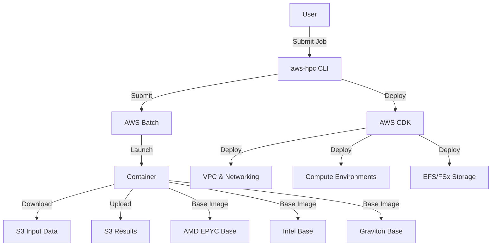

# ATOM ⚛️

**Automated Toolkit for Optimized Modeling**

*Cloud-native HPC made simple*

Welcome to ATOM documentation! ATOM provides a flexible, application-agnostic infrastructure for deploying high-performance computing applications with architecture-optimized containers and cost-efficient job scheduling. Built cloud-native from the ground up for modern research computing.

> *The fundamental unit of cloud computing*

## Overview

ATOM is designed to make running computational workloads simple, cost-effective, and performant. Whether you're running atmospheric simulations, quantum chemistry calculations, or machine learning training, ATOM handles the infrastructure complexity so you can focus on your science.

**Cloud-Native Design**: ATOM leverages cloud-native patterns including containerization, serverless orchestration, and elastic scaling to provide HPC capabilities without traditional cluster management overhead.

### Key Features

- **🏗️ Application-Agnostic Platform**: Add new scientific applications without changing infrastructure code
- **⚡ Architecture-Optimized**: Automatic builds for AMD EPYC, Intel, and ARM Graviton with processor-specific optimizations
- **💰 Cost-Optimized**: Spot instances, priority queues, and automatic architecture selection for best price/performance
- **📦 Layered Containers**: Reusable base images with compilers and libraries, fast application builds
- **🔧 Single-Node & MPI**: Support for OpenMP (single-node) and MPI (multi-node) workloads
- **🎯 Simple Job Submission**: Submit jobs via CLI without AWS console knowledge
- **📊 Cost Tracking**: Built-in cost estimation and tracking per job

## Quick Start

```bash
# Install CLI
brew install atom  # or download from releases

# Deploy an application
atom app deploy geos-chem --env benchmark

# Submit a job
atom job submit geos-chem \
  --config benchmark.yaml \
  --architecture c7a \
  --output s3://my-bucket/results/

# Monitor job
atom job status <job-id>
```

## Supported Applications

| Application | Type | Status | Domain |
|------------|------|--------|--------|
| GEOS-Chem | Classic & GCHP | ✅ Active Development | Atmospheric Chemistry |
| Gaussian | Single-node | 🚧 Planned | Quantum Chemistry |
| WRF | MPI | 🚧 Planned | Weather Modeling |
| VASP | MPI | 📋 Roadmap | Materials Science |
| ORCA | Single-node | 📋 Roadmap | Computational Chemistry |

Want to add your application? See [Platform Documentation](platform/research-computing-applications.md).

## Architecture at a Glance



## Why AWS HPC Platform?

### For Researchers

- **Focus on Science**: Simple job submission without learning AWS infrastructure
- **Cost Visibility**: Know how much your simulation will cost before running it
- **Performance**: Architecture-optimized builds deliver 2-3x better performance than generic containers
- **Flexibility**: Run on-demand or spot instances, choose any AWS region

### For Labs and Research Groups

- **Multi-User Support**: Cost allocation per user and project
- **License Management**: Built-in FlexLM and RLM integration
- **Reproducibility**: Container-based workloads ensure consistent results
- **Governance**: Centralized deployment with access controls

### For HPC Engineers

- **Infrastructure as Code**: Deploy via CDK/Terraform
- **Extensibility**: Add applications without platform changes
- **Security**: Private subnets, VPC endpoints, encryption at rest and in transit
- **Monitoring**: CloudWatch integration, cost tracking, job telemetry

## Platform Design Principles

1. **Separation of Concerns**: Platform (infrastructure) and Applications (science) are independent
2. **Versioning Independence**: Platform and applications version separately
3. **Container Layering**: Shared base images across applications
4. **Cost Transparency**: Always show estimated and actual costs
5. **Security by Default**: Private networking, encryption, least-privilege IAM

## Getting Help

- **Documentation**: You're reading it! Use the navigation on the left.
- **Q&A Discussions**: [Ask questions](https://github.com/scttfrdmn/aws-hpc/discussions/categories/q-a)
- **Feature Ideas**: [Share and discuss](https://github.com/scttfrdmn/aws-hpc/discussions/categories/ideas)
- **Bug Reports**: [Open an issue](https://github.com/scttfrdmn/aws-hpc/issues/new/choose)

## Project Status

**Current Version**: v0.1.0-alpha
**Status**: 🚧 Active Development

The platform is being extracted from the [aws-geos-chem](https://github.com/scttfrdmn/aws-geos-chem) project to create a reusable foundation for multiple scientific applications.

### What's Working

- ✅ Core platform architecture defined
- ✅ GEOS-Chem application extraction in progress
- ✅ Multi-architecture container builds
- ✅ AWS Batch integration patterns

### Coming Soon

- 🚧 CLI tool (`aws-hpc`)
- 🚧 GEOS-Chem application plugin complete
- 📋 Additional applications (Gaussian, WRF)
- 📋 Web dashboard
- 📋 Cost tracking system

See the [Roadmap](https://github.com/scttfrdmn/aws-hpc/blob/main/ROADMAP.md) for detailed plans.

## Next Steps

- **New Users**: Start with [Getting Started](platform/getting-started.md)
- **HPC Engineers**: Read about [Research Computing Applications](platform/research-computing-applications.md)
- **Contributors**: Check out [User Personas](PERSONAS.md) and [Contributing Guide](https://github.com/scttfrdmn/aws-hpc/blob/main/CONTRIBUTING.md)

---

**Questions?** Join the [discussion forum](https://github.com/scttfrdmn/aws-hpc/discussions) or open an [issue](https://github.com/scttfrdmn/aws-hpc/issues).

